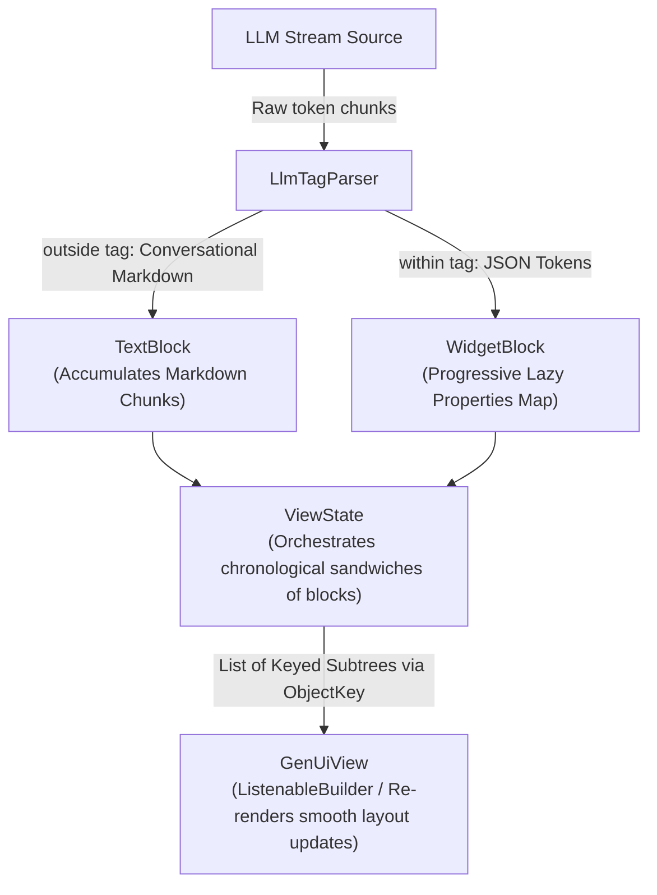
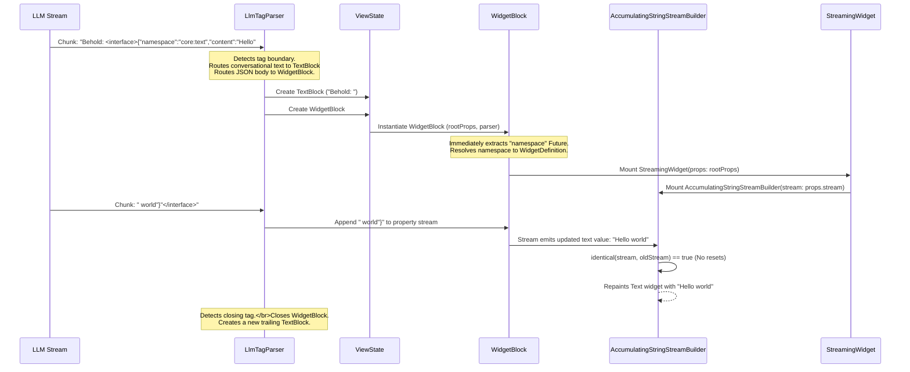

# streaming_gen_ui

### The High-Performance Streaming Generative UI Engine for Flutter

Render interactive UI components progressively and reactively as raw LLM streams flow in—character-by-character—without waiting for the full JSON response.

[API Docs](https://pub.dev/documentation/streaming_gen_ui/latest/) · [GitHub](https://github.com/ComsIndeed/streaming-gen-ui)

---

## Table of Contents
- [The Problem](#the-problem)
- [The Solution](#the-solution)
- [Quick Start](#quick-start)
- [How It Works](#how-it-works)
  - [Tag-Based Stream Multiplexing](#tag-based-stream-multiplexing)
  - [Progressive Property Parsing](#progressive-property-parsing)
  - [State Preservation & Anti-Flicker](#state-preservation-&-anti-flicker)
- [Feature Highlights](#feature-highlights)
  - [Continuous State Morphing](#continuous-state-morphing)
  - [Visual Gestalt & Generative Motion Rules](#visual-gestalt-&-generative-motion-rules)
  - [Set-Theory Registry Composition](#set-theory-registry-composition)
  - [Hand-Crafted Primitive Components](#hand-crafted-primitive-components)
- [Complete Example](#complete-example)
- [Built-In Registries Catalog](#built-in-registries-catalog)
- [API Reference](#api-reference)
  - [StreamingGenerativeUi](#streaminggenerativeui)
  - [WidgetRegistry & WidgetDefinition](#widgetregistry-&-widgetdefinition)
  - [StreamingText & StreamingWidget](#streamingtext-&-streamingwidget)
- [LLM Provider Setup](#llm-provider-setup)
- [Contributing](#contributing)
- [License](#license)

---

## The Problem

LLM APIs stream responses token-by-token. When you want the LLM to output a user interface, it usually outputs a JSON payload. Traditional approaches force you to wait for the entire JSON payload to complete, parse it via `jsonDecode()`, and then render it.

This results in:
1. **High Latency:** Users see nothing or a generic spinner for several seconds while the JSON is generated.
2. **Jarring Layout Shifts:** Sub-widgets pop in all at once, disrupting the user experience.
3. **Loss of Fluidity:** Standard Flutter builders tear down and rebuild trees upon every new token chunk, resulting in frame flickers and broken animations.

---

## The Solution

`streaming_gen_ui` solves this by combining the powerful character-by-character parser of `llm_json_stream` with a state-preserving widget tree compiler. Instead of waiting for the full response, it compiles and paints UI components character-by-character as they flow from the LLM.

- **Sequential Sandwiches:** Seamlessly interleaves conversational markdown text and dynamic widgets in a chronological list.
- **Continuous State Morphing:** Widgets grow, morph, and activate in real-time as properties stream in.
- **Reference Identity Stability:** Eliminates flickering by ensuring absolute stream stability and object-key preservation.

---

## Quick Start

Add the dependencies to your `pubspec.yaml`:
```yaml
dependencies:
  streaming_gen_ui: ^0.0.1 # Check pub.dev for the latest version
```

Or run:
```bash
flutter pub add streaming_gen_ui
```

Import the package:
```dart
import 'package:streaming_gen_ui/streaming_gen_ui.dart';
```

And configure:
```dart
// 1. Setup the central controller with a registry
final genUi = StreamingGenerativeUi(
  registry: Registries.essentials + Registries.interactive,
);

// 2. Inject the prompt fragment into your LLM's system prompt
final systemPrompt = genUi.registry.systemPromptFragment;

// 3. Pipe the live LLM token stream into the engine
await genUi.stream(
  llmStream,
  viewId: 'message-42',
  onText: (chunk) => print("Markdown text chunk: $chunk"),
  onComplete: (raw) => db.save(raw), // Save raw response containing <interface>...
);

// 4. Place the reactive view anywhere in your widget tree
Widget build(BuildContext context) {
  return genUi.view('message-42');
}
```

---

## How It Works

### Tag-Based Stream Multiplexing
The engine wraps the incoming token stream in an `LlmTagParser` from the `llm_tag_parser` package. It dynamically scans the stream character-by-character for boundary tags:
* **Text outside `<interface>...</interface>`** is treated as conversational Markdown and piped to a progressive text block.
* **Text within `<interface>` tags** is intercepted as a raw JSON widget payload and passed directly to a progressive widget compiler.



### Progressive Property Parsing
Using `llm_json_stream` under the hood, individual widgets do not wait for their full JSON schema to complete. They parse properties recursively. 

For nested components (like a column containing buttons), the parent immediately extracts the child stream and passes it down. The child widget updates self-reactively as its property stream receives tokens.



### State Preservation & Anti-Flicker
High-frequency token streaming typically triggers severe frame jitter in Flutter. `streaming_gen_ui` incorporates three premium design patterns to eliminate layout flicker:

1. **Memory-Safe Reference Stability:** Uses Dart's `identical()` comparison instead of standard equality. As properties mutate, the stream reference is preserved, completely avoiding re-subscription resets.
2. **Single-Instance Stream Caching:** Broadcast streams are generated once and cached locally within each `Block` instance.
3. **ObjectKey Tree Reconciliation:** Every dynamically parsed block widget is wrapped in a `KeyedSubtree` with an `ObjectKey` tied to the persistent `Block` instance. Flutter perfectly matches widgets during layout shifts and list growth, retaining scroll offsets and state.

---

## Feature Highlights

### 🏗️ Continuous State Morphing
Every component transitions elegantly across three lifecycle stages as the LLM streams its properties:

```
 Stage 0: Empty           Stage 1: Growing         Stage 2: Active
┌──────────────┐         ┌──────────────┐         ┌──────────────┐
│  Tag parsed, │  ────>  │ Props arrive │  ────>  │Action/button │
│   no props   │         │  and stream  │         │reserves fully│
└──────────────┘         └──────────────┘         └──────────────┘
```

* **Stage 0: Empty:** Displays a soft entrance shimmer.
* **Stage 1: Growing:** Smooth container expansion and typewriter text.
* **Stage 2: Active:** Layout bounds lock, and interactions (like buttons) transition to fully interactive.

### 🎨 Visual Gestalt & Generative Motion Rules
Crafted with premium design principles in mind, the built-in widgets adhere strictly to these motion guidelines:

* **The Ghostly Entry:** Elements fade and scale in softly from a local origin (`scale: 0.96` to `1.0`, `opacity: 0.0` to `1.0` over `200ms` with snap curves) rather than popping onto the screen.
* **Procedural Layout Growth:** Containers automatically interpolate height and border boundaries using an implicit size-tracking `AnimatedSize` wrapper.
* **Disabled-to-Active Transmutations:** Interactive elements (buttons, inputs) remain visually muted and disabled during streaming. The exact millisecond the action property resolves, the button triggers a micro-scale bounce and morphs into its primary theme color.
* **The Stable Alignment Rule:** To prevent vertical text from vibrating during size expansion, parent alignment is locked strictly to `Alignment.topCenter` or `Alignment.topLeft`.

### ➕ Set-Theory Registry Composition
Avoid prompt-drift and duplicate definitions. A `WidgetRegistry` is simply a set of widget definition references. You can compose, subtract, or filter registries using intuitive operator math:

```dart
// Composing two sets seamlessly using the + operator
final myRegistry = Registries.essentials + Registries.interactive;

// Stripping specific features for read-only situations
final readOnlyRegistry = Registries.core.without(['core:elevated_button', 'core:textfield']);

// Extracting a safe, highly specific subset
final secureRegistry = Registries.core.only(['core:text', 'core:container']);
```

### 💎 Hand-Crafted Primitive Components
Exposed in the public API for developers to build gorgeous, custom generative cards:
* **`StreamingButton`:** Smoothly morphs from a compact loading state into an interactive pill upon streaming completion.
* **`StreamingImage`:** Pulse-shimmers a matching aspect-ratio skeleton before cross-fading into the network image once the URL stream completes.
* **`StreamingSlider`:** Slowly grows the horizontal track line, slides down min/max labels, and pops the dragging thumb when default values arrive.

---

## Complete Example

A complete Flutter example demonstrating the end-to-end integration:

```dart
import 'dart:async';
import 'package:flutter/material.dart';
import 'package:streaming_gen_ui/streaming_gen_ui.dart';

void main() => runApp(const MyApp());

class MyApp extends StatelessWidget {
  const MyApp({super.key});

  @override
  Widget build(BuildContext context) {
    return MaterialApp(
      theme: ThemeData.dark(useMaterial3: true),
      home: const GenerativeChatScreen(),
    );
  }
}

class GenerativeChatScreen extends StatefulWidget {
  const GenerativeChatScreen({super.key});

  @override
  State<GenerativeChatScreen> createState() => _GenerativeChatScreenState();
}

class _GenerativeChatScreenState extends State<GenerativeChatScreen> {
  late final StreamingGenerativeUi _genUi;
  final List<String> _chatMessages = [];

  @override
  void initState() {
    super.initState();
    // 1. Instantiate the Generative UI engine with the core catalog
    _genUi = StreamingGenerativeUi(registry: Registries.core);
  }

  void _triggerLlmStream() {
    final controller = StreamController<String>();

    // 2. Register a new view and feed the stream
    _genUi.stream(
      controller.stream,
      viewId: 'response-id-100',
      onText: (textChunk) {
        // Handle conversational text increments
      },
      onComplete: (fullRawString) {
        // Save fullRawString to database
        setState(() {
          _chatMessages.add(fullRawString);
        });
      },
    );

    // Simulate streaming chunks from LLM
    final chunks = [
      "Here is the widget you asked for to configure your profile:\n\n",
      "<interface>",
      '{"namespace":"core:container","width":340,"height":200,"child":',
      '{"namespace":"core:column","children":[',
      '{"namespace":"core:text","content":"Active Profile Settings"},',
      '{"namespace":"core:elevated_button","child":',
      '{"namespace":"core:text","content":"Save Changes"},"action":"submit_profile"}',
      ']}}',
      "</interface>",
      "\n\nLet me know if you need any adjustments!"
    ];

    int index = 0;
    Timer.periodic(const Duration(milliseconds: 300), (timer) {
      if (index < chunks.length) {
        controller.add(chunks[index++]);
      } else {
        controller.close();
        timer.cancel();
      }
    });
  }

  @override
  Widget build(BuildContext context) {
    return Scaffold(
      appBar: AppBar(title: const Text('Streaming Generative UI')),
      body: Column(
        children: [
          Expanded(
            child: ListView(
              padding: const EdgeInsets.all(16),
              children: [
                // Render the progressive view
                _genUi.view('response-id-100'),
              ],
            ),
          ),
          Padding(
            padding: const EdgeInsets.all(16.0),
            child: ElevatedButton(
              onPressed: _triggerLlmStream,
              child: const Text('Start Stream'),
            ),
          ),
        ],
      ),
    );
  }
}
```

---

## Built-In Registries Catalog

Instead of exposing a single, monolithic, token-costly prompt fragment to the model, `streaming_gen_ui` divides the ecosystem into specialized sub-bundles:

| Registry Group | Target Namespace Prefix | Included Widgets | Target Token/Use Cases |
| :--- | :--- | :--- | :--- |
| **`primitives`** | `core:` | `core:box`, `core:flex`, `core:text`, `core:column`, `core:row`, `core:container`, `core:badge` | Low-level flex layout building blocks |
| **`interactive`** | `core:` | `core:elevated_button`, `core:textfield` | Interactive forms, custom callbacks |
| **`standardCards`** | `ui:` | `ui:bento_card`, `ui:list_tile`, `ui:key_value_row` | Rapidly rendered beautiful pre-designed grids and tiles |
| **`documents`** | `doc:` | `doc:terminal`, `doc:agent_stepper` | Agent logs, step indicators, console layouts |
| **`metrics`** | `dash:` | `dash:metric`, `dash:data_table` | Dashboards, key metrics, structured tabular datasets |

### Composed Super-Bundles
* **`Registries.chatApp`:** Optimized for general assistant interfaces (`documents` + `standardCards` + selected typography).
* **`Registries.dashboard`:** Pre-configured for visual analytics (`metrics` + `standardCards` + primitives).
* **`Registries.essentials`:** Minimalist layout + typography (`layout` + `core:text`).
* **`Registries.all` / `Registries.core`:** The entire prepackaged ecosystem.

---

## API Reference

### `StreamingGenerativeUi`
The central orchestrator of streaming generative UI sessions.
* `StreamingGenerativeUi({required WidgetRegistry registry, bool showInternalErrors = true})` -> Initializes the engine.
* `systemPrompt` -> Generates the compiled system prompt fragment describing all active widgets in the registry.
* `stream(Stream<String> tokenStream, {required String viewId, void Function(String chunk)? onText, void Function(String raw)? onComplete})` -> Pipes the live token stream into the target view and strips tags for standard Markdown text outputs.
* `restore({required String viewId, required String raw})` -> Instantly restores a past UI rendering from saved markdown + XML tags.
* `view(String viewId)` -> Exposes the reactive visual widget matching the given view ID.
* `disposeView(String viewId)` -> Disposes of cached states and frees memory.

### `WidgetRegistry` & `WidgetDefinition`
Defines the metadata, schemas, and builders for custom generative widgets.
```dart
final customRegistry = WidgetRegistry(
  widgets: {
    "custom:user_card": WidgetDefinition(
      description: "Renders a profile summary card of a user",
      properties: {
        "name": "The user's full name (String)",
        "role": "Current career title (String)",
        "verified": "Whether user is verified (Boolean)",
      },
      jsonExample: '{"namespace":"custom:user_card","name":"John Doe","role":"Staff Engineer","verified":true}',
      builder: (context, props) {
        return Card(
          child: Column(
            children: [
              // Use leaf wrappers to listen to string streams
              StreamingText(props: props, propertyName: 'name'),
              StreamingText(props: props, propertyName: 'role'),
            ],
          ),
        );
      },
    ),
  },
);
```

### `StreamingText` & `StreamingWidget`
Exposed leaf components to eliminate boilerplate in custom widget definitions:
* **`StreamingText`:** Automatically binds to a target property on a `PropertyStream` and displays the accumulated typewriter text without stateful boilerplate.
* **`StreamingWidget`:** Resolves nested, dynamic children from a sub-stream directly into visual sub-trees.

---

## LLM Provider Setup

### OpenAI (Dart `dart_openai` Package)
```dart
final chatStream = OpenAI.instance.chat.createStream(
  model: "gpt-4",
  messages: chatMessages,
);

final tokenStream = chatStream.map((chunk) => chunk.choices.first.delta.content ?? "");
await genUi.stream(tokenStream, viewId: 'view-42');
```

### Anthropic (Dart `anthropic_sdk_dart` Package)
```dart
final chatStream = anthropic.messages.stream(
  model: 'claude-3-opus',
  messages: messages,
);

final tokenStream = chatStream.map((event) => event.delta?.text ?? '');
await genUi.stream(tokenStream, viewId: 'view-42');
```

### Gemini (Google AI Dart SDK `google_generative_ai` Package)
```dart
final responseStream = model.generateContentStream(content);
final tokenStream = responseStream.map((chunk) => chunk.text ?? "");
await genUi.stream(tokenStream, viewId: 'view-42');
```

---

## Contributing
Contributions are extremely welcome!
1. Check the open issues on GitHub.
2. Discuss major architecture changes in an issue before writing code.
3. Run `flutter test` to ensure zero regressions.
4. Maintain a clean, craft-minded styling code convention.

---

## License
MIT License. See [LICENSE](LICENSE) for details.
