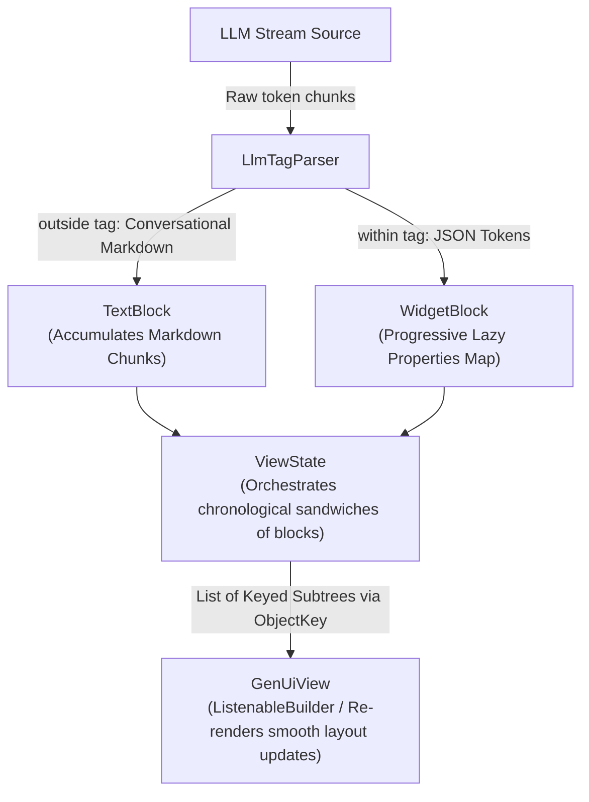
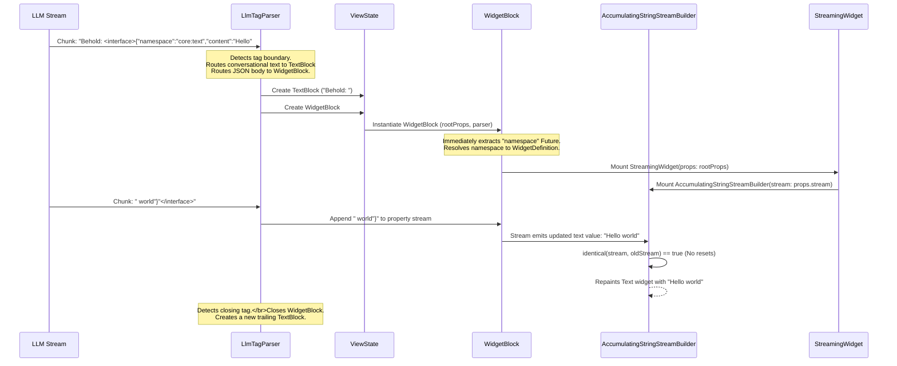

# Streaming Generative UI Engine Reference

A premium developer guide and technical reference detailing the architecture, data flow, component interfaces, and state preservation design patterns powering the `streaming_gen_ui` package.

---

## 🏗️ 1. Architecture Overview

The `streaming_gen_ui` package is a high-performance, real-time widget rendering engine for Large Language Model (LLM) streams. Rather than waiting for a full JSON payload to arrive and block the user interface, it compiles and paints UI components character-by-character as they flow from the model.



---

## 🔄 2. Character-by-Character Data Flow

The following sequence diagram tracks a single raw LLM token stream through the tag parser, block creation, progressive property evaluation, and final visual paint:



---

## 🧩 3. Key Core Components

### 3.1 `LlmTagParser`
The tokenizer and boundary manager. It wraps an incoming `Stream<String>` and splits it into two distinct multiplexed output streams:
*   `outside("<interface>")`: Conversational markdown text.
*   `within("<interface>")`: JSON widget payloads.
It features a character-by-character lookahead buffer to dynamically resolve tags without interrupting the markdown flow.

### 3.2 `ViewState`
An orchestrator holding the chronological list of `Block` instances (`_blocks`).
*   It listens to `LlmTagParser`'s text and JSON streams.
*   It groups contiguous conversational segments into `TextBlock` instances and tagged widgets into `WidgetBlock` instances.
*   Whenever a chunk is received, it triggers a lightweight notification to rebuild its active views.

### 3.3 `Block` Hierarchy
Representations of parsed contents, with clean stream caching mechanics:
*   **`Block` (Base)**: Features a `Stream.multi` stream generator. To prevent flickering across rebuilds, the `stream` getter caches its generated stream instance inside a private `_cachedStream` field, ensuring perfect reference identity (`identical()`).
*   **`TextBlock`**: Contains the accumulated markdown segment.
*   **`WidgetBlock`**: Contains the `JsonStreamParser` from the `llm_json_stream` package. It progressively parses properties recursively and retrieves the requested `WidgetDefinition` from the registry.

---

## 📝 4. Detailed Component API Signatures

Below are the complete Dart interface signatures for the primary components of the engine.

### 4.1 Base Block System (`lib/src/models/block.dart`)

```dart
abstract class Block {
  final WidgetRegistry registry;
  
  Block({required this.registry});

  /// The cached Stream.multi reference that guarantees absolute stability.
  Stream<String> get stream;

  /// Appends an incoming chunk to the block's parser or buffer.
  void addChunk(String chunk);

  /// Closes the block's stream controller, completing the stream.
  void close();

  /// Compiles and builds the actual Flutter representation of the block.
  Widget build(BuildContext context);
}
```

### 4.2 ViewState (`lib/src/models/view_state.dart`)

```dart
class ViewState with ChangeNotifier {
  final WidgetRegistry widgetRegistry;
  final bool showInternalErrors;
  final GenerativeUiErrorBuilder? errorBuilder;

  ViewState({
    required Stream<String> stream,
    required this.widgetRegistry,
    this.showInternalErrors = true,
    this.errorBuilder,
  });

  /// The chronological list of parsed blocks.
  List<Block> get blocks;

  /// Compiles a fully dynamic, reactive Column representing the parsed blocks,
  /// preserving widget state perfectly via KeyedSubtree and ObjectKey wrappers.
  Widget get widget;

  /// Sets up LlmTagParser and starts listening to stream events.
  void seperateStream(Stream<String> stream);
}
```

### 4.3 StreamingGenerativeUi Controller (`lib/src/controllers/streaming_gen_ui.dart`)

```dart
class StreamingGenerativeUi {
  final WidgetRegistry registry;
  final bool showInternalErrors;
  final GenerativeUiErrorBuilder? errorBuilder;

  StreamingGenerativeUi({
    required this.registry,
    this.showInternalErrors = true,
    this.errorBuilder,
  });

  /// Returns the programmatically compiled prompt describing all registered widgets.
  String get systemPrompt;

  /// Pipes a live LLM token stream to the designated viewId.
  Future<void> stream(
    Stream<String> tokenStream, {
    required String viewId,
    void Function(String textChunk)? onText,
    void Function(String finalRaw)? onComplete,
  });

  /// Restores a past response from a saved raw payload (markdown + XML).
  void restore({required String viewId, required String raw});

  /// Mounts and returns a reactive view associated with the viewId.
  Widget view(String viewId);

  /// Cleans up resources and disposes of the view state for the viewId.
  void disposeView(String viewId);
}
```

### 4.4 Widget Registry contracts (`lib/src/models/widget_registry.dart`)

```dart
typedef WidgetBuilderFunction = Widget Function(BuildContext context, PropertyStream props);

class WidgetDefinition {
  final WidgetBuilderFunction builder;
  final String description;
  final Map<String, String> properties;
  final String jsonExample;

  const WidgetDefinition({
    required this.builder,
    required this.description,
    required this.properties,
    required this.jsonExample,
  });
}

class WidgetRegistry {
  final Map<String, WidgetDefinition> widgets = {};

  /// Registers a custom widget definition under a unique snake_case namespace.
  void register(String namespace, WidgetDefinition definition);

  /// Compiles and generates a detailed system prompt schema.
  String get systemPromptFragment;
}
```

---

## ⚡ 5. State Preservation & Anti-Flicker Design Patterns

During real-time streaming, the parent widget tree rebuilds at high frequency (often 30–60 times per second as token chunks arrive). In traditional Flutter architectures, this causes complete widget tree rebuilds, stream re-subscriptions, and visual layout jumps ("flicker"). 

To deliver a premium, native feel, `streaming_gen_ui` implements three key patterns to enforce absolute state stability:

### 5.1 Memory-Safe Reference Stability (`!identical`)
When state-holding widgets compare streams or property streams in `didUpdateWidget`, standard equality operators (`!=`) will evaluate to `true` if the underlying JSON content gets mutated or appended. 

We check for absolute **reference identity** using Dart's `identical()` function:
```dart
@override
void didUpdateWidget(covariant MyStreamingWidget oldWidget) {
  super.didUpdateWidget(oldWidget);
  
  // Compares object memory addresses rather than contents
  if (!identical(widget.props, oldWidget.props)) {
    _reinitializeProps();
  }
}
```
If the underlying reference remains the same, the stream is **never** re-subscribed to, preserving typing animations and accumulated content uninterrupted.

### 5.2 Single-Instance Multi-Stream Caching
The stream getter inside `Block` generates a broadcast `Stream.multi` pipeline. To prevent this getter from returning a new stream instance on every rebuild, the result is cached inside a private field upon initial invocation:
```dart
Stream<String>? _cachedStream;

Stream<String> get stream {
  _cachedStream ??= Stream<String>.multi((controller) {
    // Pipeline setup
  });
  return _cachedStream!;
}
```

### 5.3 Enforcing State Matching via `ObjectKey`
When blocks are dynamically appended or closed in `ViewState`, the length of the block list shifts. To prevent Flutter from mismatching widgets by index or disposing of active typing states, every compiled block widget is explicitly wrapped inside a `KeyedSubtree` with an `ObjectKey` bound to the block's persistent instance:
```dart
children: _blocks.map((block) {
  return KeyedSubtree(
    key: ObjectKey(block),
    child: block.build(context),
  );
}).toList(),
```
This forces the Flutter element tree to preserve the state of that exact block, completely eliminating layout jumps and unmounting.
