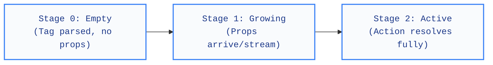

# Design Engineering Guidelines for Streaming & Generative UI

These guidelines define the craft standard for building interfaces that react to **real-time, progressive property streaming (Continuous State Morphing)**. 

Unlike traditional animation guidelines that focus on transitions between static states (State A to State B), these guidelines govern interfaces that grow, morph, and activate procedurally as property chunks arrive from an AI stream.

---

## 🏗️ The Core Concept: Continuous State Morphing

In a standard application, data is awaited and loaded fully before paint. In a Generative UI application, data arrives continuously in three distinct stages:

Every component must accommodate this lifecycle. Nothing must appear instantly; every element must animate its own birth, expansion, and functional activation.

---

## 🎨 The Five Rules of Generative Motion

### 1. The Ghostly Entry Rule
* **Problem:** When the parser identifies a tag (e.g. `<interface>`), the widget mounts and pops onto the screen instantly, causing jarring visual jumps.
* **Guideline:** Never scale an element from `0` or snap its opacity. Every component must fade and scale in from a soft, local origin.
* **Execution:** Pre-allocate a micro-footprint and transition it using a spring or snap curve:
  * **Scale:** `0.96` $\rightarrow$ `1.0`
  * **Opacity:** `0.0` $\rightarrow$ `1.0`
  * **Duration:** `200ms` to `250ms` using `Curves.easeOutCubic` or spring physics.

### 2. Procedural Layout Growth
* **Problem:** Text wrapping or child list expansion pushes sibling elements down in a heavy, rigid way.
* **Guideline:** The parent containers of streaming elements must automatically morph their borders and height boundaries smoothly.
* **Execution:** Always wrap the root of custom cards and layout lists in an implicit size-tracking widget (like `AnimatedSize`). This automatically captures and interpolates layout changes without boilerplate.

### 3. Disabled-to-Active Transmutations
* **Problem:** Inputs and buttons start in a disabled state, then snap into active, clickable states instantly when the stream finishes.
* **Guideline:** Animate the transition between the "loading/generating" state and the "active/functional" state.
* **Execution:**
  * Keep the button's background neutral and low-contrast while generating.
  * As soon as the callback action resolves, morph the background color to the primary brand color and trigger a micro-scale pop (`scale: 1.0` $\rightarrow$ `0.98` $\rightarrow$ `1.02` $\rightarrow$ `1.0`).
  * Enable click/tap ripple indicators (`InkWell`) only after this transition completes.

### 4. Shimmer-to-Fade-In Media Frames
* **Problem:** Images or dynamic visual blocks cannot be streamed (the URL is unusable until the string is completed), leading to blank spaces followed by sudden image pops.
* **Guideline:** Allocate the layout space immediately with a skeleton/shimmer placeholder, and cross-fade to the dynamic media once loaded.
* **Execution:**
  * Render a styled container with a pulsing shimmer gradient matching the target aspect ratio.
  * Once the URL resolves and the image successfully loads, cross-fade using an `AnimatedSwitcher` or `FadeInImage` over `300ms`.

### 5. Anatomy-First Slider Emergence
* **Problem:** Controls like Sliders pop onto the screen fully formed, causing massive structural layout shifts as numbers and labels draw.
* **Guideline:** Reveal the control anatomy procedurally as properties are streamed.
* **Execution:**
  * **Step A (Track):** Render a thin, subtle horizontal track line growing from left-to-right.
  * **Step B (Labels):** Slide down the minimum/maximum bounds when they resolve.
  * **Step C (Thumb):** Pop the active dragging thumb into view once the default value arrives.

---

## 🛠️ Hand-Crafted Primitive Components

Rather than relying entirely on default Material widgets (which are often structurally rigid and design-restricted), we build **custom interactive primitives** designed from the ground up to support morphing and progressive state changes.

These custom primitives are exposed in the public API so developers can build their own custom cards or feed them directly to the LLM:

### A. `StreamingButton` (Continuous Morphing Button)
* **Start State:** Neutral, compact pill.
* **Streaming State:** Size, height, and width expand dynamically as its child text streams.
* **Active State:** On action resolution, morphs background color and enables ripple tap physics.

### B. `StreamingImage` (Skeleton-to-Fade Image Card)
* **Placeholder:** Aspect-ratio locked shimmer container with rounded borders.
* **Transition:** Cross-fades into the network image once fully fetched.

### C. `StreamingSlider` (Procedurally Evolving Slider)
* **Start State:** Simple track line.
* **Evolving State:** Labels slide down; thumb emerges with a scale pop.

---

## 📐 Animation Decisions Table

Use this reference table to design curves and durations for streaming elements:

| Element Action | Target Duration | Curve / Physics | Why |
| :--- | :--- | :--- | :--- |
| **Entrance** | `200ms` | `cubic-bezier(0.2, 0.8, 0.2, 1)` | Rapid snap entrance prevents lag feel |
| **Boundary Morph** | `300ms` | `Curves.easeInOutCubic` | Soft, organic layout adjustments |
| **Color Transmutation** | `250ms` | `Curves.linear` or `easeOut` | Smooth color transitions without flashing |
| **Active Click State** | `80ms` | `Curves.fastOutSlowIn` | Instant tactile feedback for button press |
