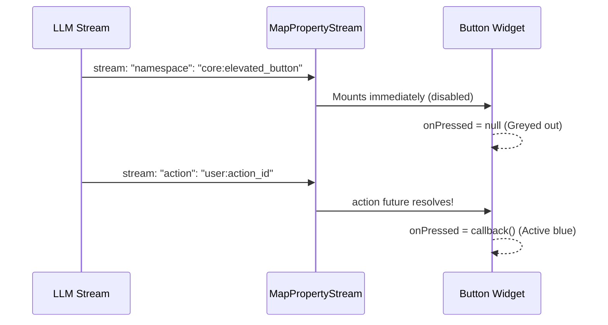

# Streaming Gen UI Internal Architecture

This document breaks down the internal mechanics of how the `streaming_gen_ui` engine isolates XML-like interface boundaries, orchestrates chronological rendering block lists, and progressive updates complex widgets under the hood.

---

## 🏗️ Core Architecture Overview

```mermaid
graph TD
    A[LLM Token Stream] ──> B[StatefulStreamParser]
    B ── Conversational Text ──> C[TextBlock]
    B ── XML Boundary Match ──> D[MapPropertyStream]
    C ── Appends ──> E[ViewState Block List]
    D ── Spawns ──> F[InteractiveBlock]
    F ── Appends ──> E
    E ── Triggers ──> G[GenUiView ListenableBuilder]
    G ── Chronological Column ──> H[Text + StreamingWidget Sandbox]
```

---

## ⚡ 1. The Token-Level Multiplexing Engine

Standard JSON parsers require a complete, valid JSON string to begin execution. To enable zero-latency streaming rendering, `streaming_gen_ui` uses a customized character-by-character lookahead multiplexer state machine (`StatefulStreamParser`).

### Lookahead State Machine Transitions

```dart
// ─────────────────────────────────────────────
// STATE TRANSITIONS
// ─────────────────────────────────────────────
enum ParserState { text, startTag, json }
```

1. **`ParserState.text` (Conversational Markdown)**:
   * The parser forwards every single streamed character directly to the active `TextBlock` via `onText`.
   * If it detects a `<` character, it transitions into a lookahead buffer.
   * If subsequent tokens match `<interface`, it shifts to `startTag`. If the match breaks, it flushes the buffered text and stays in `text` mode.

2. **`ParserState.startTag` (Target Routing Resolution)**:
   * The parser accumulates characters inside the XML opening tag until matching `>`.
   * It scans the tag for attributes like `viewId="side-panel"` or `viewId='global-modal'`.
   * It matches a target view and fires `onInterfaceBlockStart(targetViewId, jsonStream, startTag)`.

3. **`ParserState.json` (Progressive Property Stream)**:
   * It pipes all inner tokens directly into a `StreamController<String>` which updates a local `MapPropertyStream` dynamically.
   * If it detects `</interface>`, it closes the JSON stream controller and triggers `onInterfaceBlockEnd` to restore regular conversational markdown.

---

## 📦 2. Chronological Alternating Blocks

To avoid pretext or posttext flying to the top or disappearing when widgets generate, the view state maintains a chronological sandwich list of dynamic blocks:

```dart
// ─────────────────────────────────────────────
// THE VIEW BLOCK LIFECYCLE
// ─────────────────────────────────────────────
abstract class ViewBlock {}

class TextBlock extends ViewBlock {
  String text = '';
}

class InteractiveBlock extends ViewBlock {
  final String targetViewId;
  final MapPropertyStream rootMapStream;
  bool isComplete = false;
  
  InteractiveBlock({
    required this.targetViewId,
    required this.rootMapStream,
    this.isComplete = false,
  });
}
```

### The Block Sandwich Lifecycle

* **Step 1 (Pretext)**: Token stream begins in conversational mode. We add a `TextBlock` to `state.blocks` and append chars as they fly in.
* **Step 2 (The Interface Tag)**: The lookahead parser catches `<interface>`. We freeze the active `TextBlock`, create a new `InteractiveBlock` with a progressive JSON sub-stream, and push it to `state.blocks`.
* **Step 3 (Posttext)**: The parser catches `</interface>`. We mark the visual block as complete, append a fresh `TextBlock` to the end of the list, and stream subsequent characters there.

The `GenUiView` mounts a reactive `ListenableBuilder` listening to `ViewState`. It compiles a clean, dynamic, vertical `Column` mapping these blocks in exact chronological order:

```dart
// ─────────────────────────────────────────────
// RENDER COMPILATION SANDWICH
// ─────────────────────────────────────────────
Column(
  children: state.blocks.map((block) {
    if (block is TextBlock) {
      return Text(block.text, style: themeAdaptiveStyle);
    } else if (block is InteractiveBlock) {
      return StreamingWidget(mapStream: block.rootMapStream);
    }
  }).toList(),
)
```

---

## 🧩 3. Reactive Widget Compilation (`llm_json_stream`)

Rather than waiting for the widget JSON block to complete, the package begins rendering widgets on the **very first character** of the JSON block!

### Recursive Property Resolution

For highly-nested layouts (e.g. a `core:column` holding container and button children), we utilize recursive lazy evaluation:

```dart
// ─────────────────────────────────────────────
// PROGRESSIVE HIERARCHY EVALUATION
// ─────────────────────────────────────────────
class ColumnWidget extends StatelessWidget {
  final MapPropertyStream properties;

  Widget build(BuildContext context) {
    // 1. Get the progressive list property for children
    final childrenStream = properties.getListProperty('children');

    // 2. Map property streams to self-updating sub-widgets
    return StreamBuilder<List<dynamic>>(
      stream: childrenStream.stream,
      builder: (context, snapshot) {
        final children = childrenStream.value ?? [];
        return Column(
          children: children.map((childPropStream) {
            return StreamingWidget(mapStream: childPropStream as MapPropertyStream);
          }).toList(),
        );
      },
    );
  }
}
```

* Parents render **immediately** without waiting for nested children configurations to finish streaming.
* Sub-properties are passed as dedicated self-contained property streams, letting widgets dynamically paint and update themselves without rebuilding parent layers.

---

## ⚡ 4. Dynamic Actions Lifecycle (Disabled-to-Active Transitions)

Actions and form buttons streamed from the LLM shouldn't be clickable until the complete DSL action descriptor is available. `streaming_gen_ui` handles this seamlessly:



1. **Mounting**: The button paints itself the instant `"namespace": "core:elevated_button"` is parsed.
2. **Awaiting Action**: We call `mapStream.getStringProperty('action').future`. The callback remains null, so the button is drawn in a premium, disabled state.
3. **Activation**: The exact millisecond the action string matches in the parser, the future resolves. The button dynamically transitions into an active, clickable state with fluid micro-animations!
