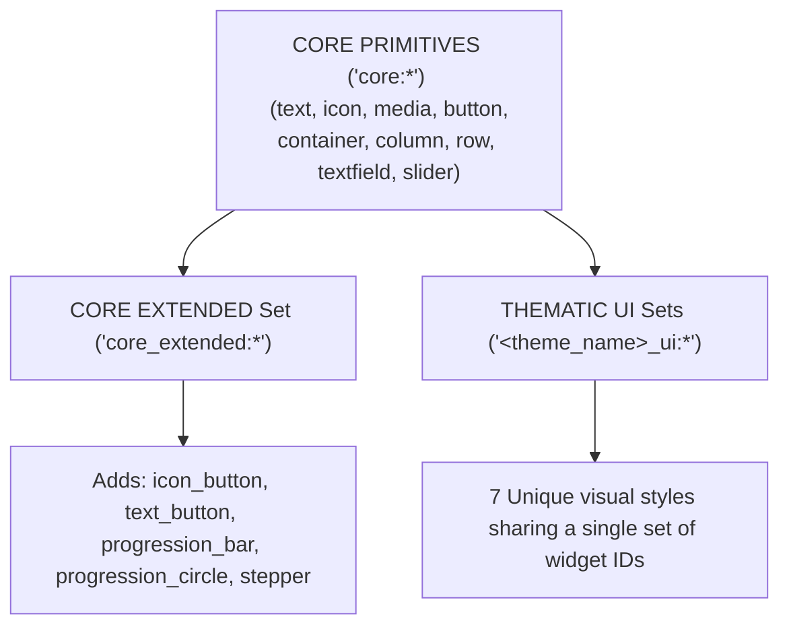

# Widget Catalog Overhaul & Theme Specification

This specification documents the architecture and implementation blueprint for overhauling the widget catalog inside the `streaming_gen_ui` library. It organizes widgets into clear registries, details themed component structures, and establishes strict guidelines for clean, fluid visual styling.

---

## 🏛️ 1. Registry Architecture & Set-Theory Composition

The widget ecosystem is organized into three distinct layers. Leveraging the package's **Set-Theory Composition API**, registries can be dynamically combined, filtered, or subtracted using the `+`, `only()`, and `without()` operators.



### 🧱 Tier 1: Core Primitives (`core:*`)
Low-level layout and interaction builders with a minimal token footprint.
*   **`core:text`**: Progressive typewriter text block.
*   **`core:icon`**: Ambient Material icons renderer.
*   **`core:media`**: Aspect-ratio-locked image/video placeholder.
*   **`core:button`**: Tactile, unstyled layout container button with action callbacks.
*   **`core:container`**: Bounded box container supporting margins, padding, colors, and border radius.
*   **`core:column`**: Self-appending progressive vertical layout.
*   **`core:row`**: Self-appending progressive horizontal layout.
*   **`core:textfield`**: Interactive text input box.
*   **`core:slider`**: Interactive range selector.

### ⚡ Tier 2: Core Extended (`core_extended:*`)
Composed widgets built directly on top of Core, simplifying advanced LLM generative flows:
*   **`core_extended:icon_button`**: Circular/square tactile icon button with hover feedback.
*   **`core_extended:text_button`**: Low-emphasis interactive link/text button.
*   **`core_extended:progression_bar`**: Linear horizontal progressive loading indicator.
*   **`core_extended:progression_circle`**: Circular loading indicator/ring.
*   **`core_extended:stepper`**: Multi-step vertical accordion flow using a fluid, elegant vertical size transition (`SizeTransition`) to expand the active step and collapse inactive steps.
*   *Plus all Core primitives.*

### 🎨 Tier 3: Themed Widgets (`<theme_name>_ui:*`)
Dynamic component interfaces supporting custom aesthetic variations.
*   **Themes**: `material`, `fluent`, `apple`, `glassmorphic`, `neumorphic`, `skeumorphic`, `brutalist`.
*   **Unified Identifiers (`ui_name`)**: `card`, `user_profile`, `carousel`, `button`, `textfield`, `slider`, `switch`, `badge`, `progress`, `dialog`.
*   **Visual Parameters (`themeSettings`)**: Custom colors or geometries passed at runtime fall back on theme presets:
    ```json
    {
      "namespace": "glassmorphic_ui:card",
      "themeSettings": {
        "primaryColor": "#6366F1",
        "borderRadius": 16.0
      },
      "title": "Main Title"
    }
    ```

---

## 📝 2. Detailed Themed Component Specs

### A. Polymorphic Layout Card (`<theme_name>_ui:card`)
To prevent token bloat, all catalog card layouts (list-tiles, product cards, pricing boxes) are consolidated into a single card widget interface across all themes.

*   **Layout Modes (`imagePosition`)**:
    *   `"left"` / `"right"` (Mini/List-Tile layout): Renders a compact horizontal row, placing the image as a leading/trailing aspect-locked box. Ideal for navigation tiles, contacts, and news logs.
    *   `"top"` / `"bottom"` (Cover Photo layout): Spans the full width of the card, placing the image at the top or bottom of the stack to serve as a primary hero visual.
    *   `null` / Omitted: Standard container card with no image.
*   **Header Indicators**: Optional `statusLabel` and `statusStyle` display a status indicator badge alongside the title metadata.
*   **JSON Schema**:
    ```json
    {
      "namespace": "material_ui:card",
      "title": "Vincent Sanicolas",
      "subtitle": "Flutter and Web Developer",
      "imageUrl": "https://images.unsplash.com/photo-1534528741775-53994a69daeb?w=120",
      "imagePosition": "left",
      "statusLabel": "Active",
      "statusStyle": "success",
      "body": [
        { "namespace": "core:text", "content": "Specializing in premium Flutter interactions." }
      ]
    }
    ```

---

### B. User Profile Card (`<theme_name>_ui:user_profile`)
A dedicated themed card built to display user profiles, contacts, and portfolios beautifully. It includes built-in styling for avatars, names, titles, social buttons, and visual tags.

*   **JSON Schema**:
    ```json
    {
      "namespace": "material_ui:user_profile",
      "name": "Vincent Sanicolas",
      "role": "Flutter and Web Developer",
      "website": "https://www.vincentsanicolas.me",
      "avatarUrl": "https://images.unsplash.com/photo-1534528741775-53994a69daeb?w=120",
      "bio": "Building high-performance premium mobile & web applications with gorgeous interactive designs.",
      "skills": ["Flutter", "Dart", "Web", "Tailwind", "Firebase"],
      "action": "view_portfolio"
    }
    ```

---

### C. Swipable Media Carousel (`<theme_name>_ui:carousel`)
Consolidates all horizontal viewports and sliders into a high-fidelity carousel:

#### 1. Stacking Media Carousel (`carouselType: "stack"`)
*   **Concept**: 3D stacked deck of cards (primarily for visual photo portfolios).
*   **Visual Style**: Cards are stacked in depth perspective. Sub-layers scale down (`scale: 0.9`) and fade slightly. Swiping slides the top card away and cycles it to the back.

#### 2. Sliding Media Carousel (`carouselType: "slide"`)
*   **Concept**: Horizontal page viewport slider revealing card edges.
*   **Visual Style**: Uses a `PageController` with a custom viewport fraction (e.g., `0.85`). The active card resides in full focus, while the adjacent left/right cards are slightly visible, scaled down (`scale: 0.9`), and dimmed.

---

## ✨ 3. Styling & Animation Standards

### 🌓 Ambient Theme Adaptability
Every themed widget **must adapt seamlessly** to the active host context `ThemeData` (supporting dark mode, light mode, and dynamic tinting out of the box).
*   Use `Theme.of(context)` for surface background, text styling, and icon colors.
*   Theme settings overrides (like hex color codes passed by the LLM) should be adjusted dynamically to maintain appropriate legibility contrast unless `exactColor: true` is set.

### 🧩 Empty & Missing Parameter Protection
To prevent broken frames or null pointer failures during active property streams:
*   **Do not render a text/content widget** if its dynamic parameter (e.g., card `title` or `subtitle`) is missing, null, or empty.
*   The space must be kept compact or occupied by a sleek skeletal shimmer, rather than rendering empty string blocks or throwing overflows.

### 📐 Dynamic Size Morphing & Overflows (Jitter Prevention)
For all container and card-based widgets, we enforce fluid size adjustments:
*   Wrap the root boundary in an **`AnimatedSize`** container with custom durations (`200ms` - `300ms`) and organic curves (`Curves.easeOutCubic`) so height and width expand dynamically based on children requirements.
*   **The Stable Alignment Rule**: Set `AnimatedSize.alignment` strictly to `Alignment.topLeft` (or `Alignment.topCenter` for vertical panels, `Alignment.centerLeft` for horizontal items) to lock already-rendered content in place, preventing jitter or shaking as boundary boxes resize.
*   Ensure scroll and clip behaviors (like `Clip.antiAlias` or scroll offsets) are set to handle sudden data expansion gracefully without creating rigid layout red-lines.

### 🌀 Emil Kowalski + Streaming Animation Synthesis
We merge high-fidelity micro-animation principles with real-time progressive streaming bounds:
*   **Tactile Active States**: Every button and clickable element needs a responsive `:active` pressed state. Apply a quick scale transformation (`scale: 0.97`) on tap to provide tactile physical confirmation.
*   **Stable Loading States**: Always reserve layout space for loading progress loops or spinners to prevent layout shifts on activation.
*   **Fluid Entrances**: Zero sudden pops or persistent shakes. Elements must fade in (`opacity: 0.0` $\rightarrow$ `1.0`) while lightly scaling up (`scale: 0.96` $\rightarrow$ `1.0`) over `200ms` using `cubic-bezier(0.2, 0.8, 0.2, 1)`.
*   **Text Rendering Exception**: While standard static UIs utilize lines of shimmers for unloaded blocks, our streaming system displays the progressively arriving string chunk directly into the stream block. Unloaded text blocks should not render any element until the string content starts streaming.

---

## 🎨 4. Theme Aesthetic Specifics

### 📦 Material 3 (`material_ui:*`)
Follows M3 specifications. Features curved-16 geometries, filled tonal containers, soft drop-shadow elevations, dynamic color schemers, and organic ink ripples (`InkWell`).

### 🪟 Windows Fluent (`fluent_ui:*`)
Windows 11 Fluent guidelines. Heavy frosted acrylic panels (`BackdropFilter` sigma 10), ultra-thin crisp white borders (opacity 0.08) reflecting light, Mica sheet layout hierarchies, and strict 8dp corner radius structures.

### 🍎 Apple Human Interface (`apple_ui:*`)
Sleek iOS/macOS interface. Employs mathematically smooth squircles using **`RoundedSuperellipseBorder`** (integrated within the catalog codebase), ultra-thin outlines (0.5dp), high-translucent glassy sheets, and SF-Pro typography.

### 🧪 Glassmorphism (`glassmorphic_ui:*`)
Minimalist, clean, modern glassmorphic look. Similar to Windows Fluent but more translucent, with higher blur ratings (sigma 16+), clean soft white gradient overlays, and glowing glassy reflections.

### 🏔️ Neumorphism (`neumorphic_ui:*`)
Soft-extruded physical surface layout. Widgets take the exact color of their parent background. The tactile surface is simulated with dual soft light-source shadows: top-left soft white highlights (`Offset(-4, -4)`) and bottom-right dark ambient shadows (`Offset(4, 4)`). Tapping switches shadows to inner/inset gradients to simulate physical compression.

### 📻 Skeuomorphism (`skeumorphic_ui:*`)
Vintage physical instrument panels. High-fidelity realistic textures (carbon fiber, glossy glass, brushed steel), metallic dial knobs, heavily beveled borders, glossy white light reflection sheets, and deep 3D inner shadows.

### ⚡ Neo-Brutalism (`brutalist_ui:*`)
Chunky, flat retro art style. Features thick, high-contrast black borders (`3px`), flat offset 2D black shadows (`Offset(4, 4)` with zero blur), electric highlight colors (cyan, electric pink, hot yellow), and monospace font styling.
